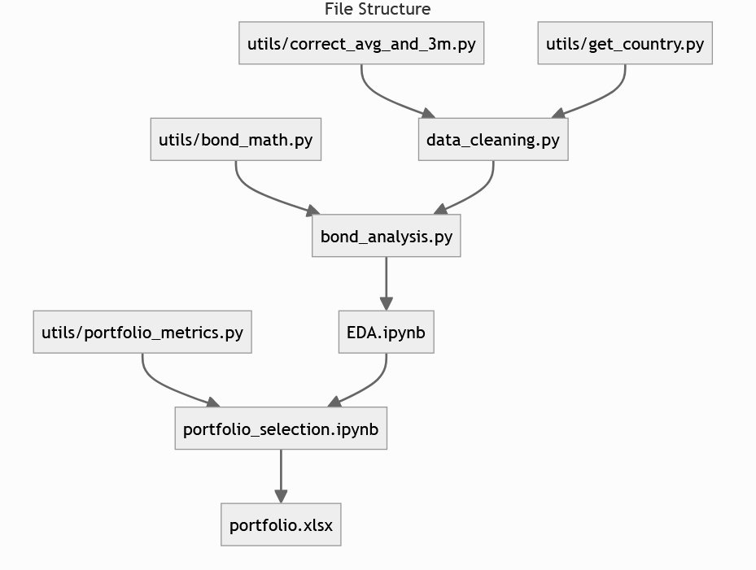

# Bond Investment Strategy - Case Study



***

### Notes on Installation

To clone this repository in your local machine,

```shell
git clone https://github.com/yildirimalper/case-study-bond-investment
```

After cloning repository, by using the `environment.yml` file, you can recreate the exact environment required for the project with:

```shell
conda env create -f environment.yml
conda activate bond-case-study
```